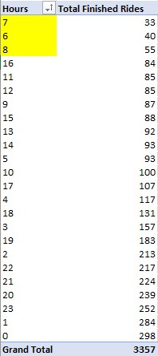
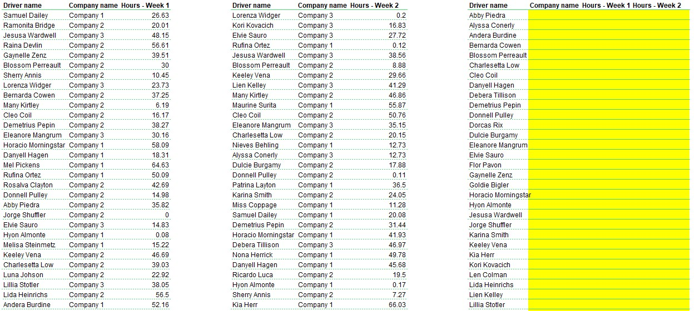
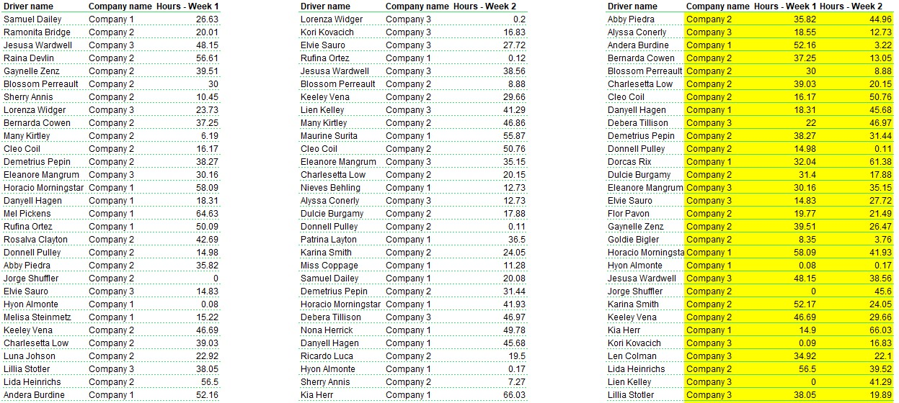
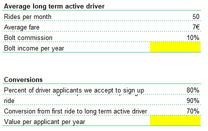
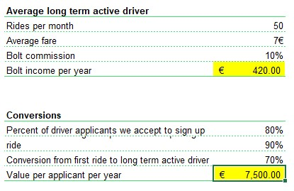
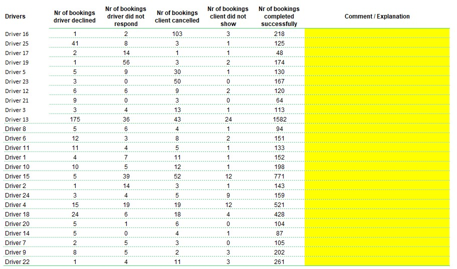
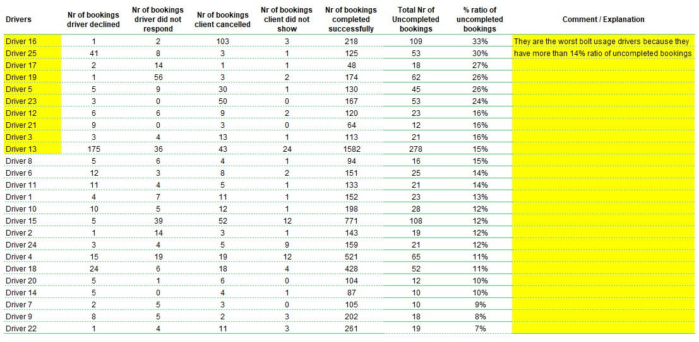
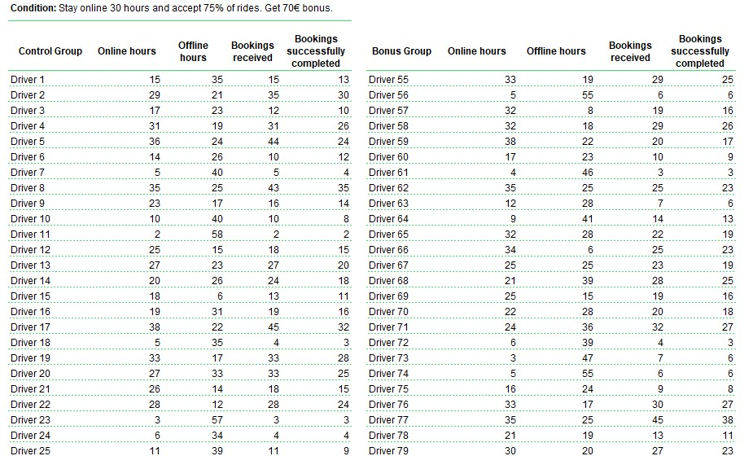
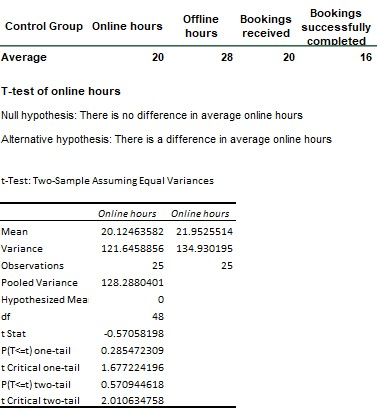
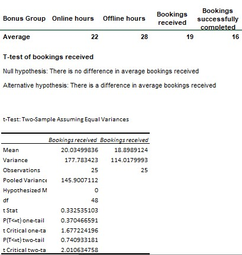

# Bolt Data Analysis
Bolt is an Estonian mobility company that offers ride-hailing, micromobility rental, food and grocery delivery, and carsharing services. In Tanzania Bolt provides ride-hailing services. The following is the analysis of finctional data from Bolt company 

## Analysis Tasks
The task was to showcase analysis and data wrandling skills in Excel. 

## Deliverables						
1) Ride Concentration: Build a Pivot Table using the given week's data and highlight the hour with lowest concentration of Finished Rides.						
2) Supply Hours: Your task is to find a quick way and fill in the highlighted cells by using Excel formulas.						
3) Driver Lead Value and Lifetime Value: Calculate in the highlighted cells by using Excel formulas how much can we invest per driver applicant to be profitable in 12 months.						
4) Problematic Drivers: Which 10 drivers have the worst usage of Bolt? Why are they outliers? Highlight them and explain why.						
5) Campaign Results: We offered 50% of our drivers monetary bonuses to increase their activity. Compare the results with the control group and explain if the campaign was successful and whether we should do it again or not.						

## Ride Concentration
*Build a Pivot Table using the given week's data and highlight the hour with lowest concentration of Finished Rides.*

The result shows that morning hours from 6 to 8 has the lowest total finished rides. Morning hours are the rushing hours where many people go to work, hypothetically, the presence of many unfinished rides may be caused by traffic jam causing customers to change means of transpot. A further analysis should be done to know the cause

## Supply Hours 
*Your task is to find a quick way and fill in the highlighted cells by using Excel formulas.*

**Formula**

`` =IF(ISTEXT(INDEX($C$6:$C$55, IF(ISNUMBER(MATCH(J50,$B$6:$B$55,0)),MATCH(J50,$B$6:$B$55,0),MATCH(J50,$F$6:$F$55,0)))),INDEX($C$6:$C$55, IF(ISNUMBER(MATCH(J50,$B$6:$B$55,0)),MATCH(J50,$B$6:$B$55,0),MATCH(J50,$F$6:$F$55,0))),INDEX($G$6:$G$55, IF(ISNUMBER(MATCH(J50,$B$6:$B$55,0)),MATCH(J50,$B$6:$B$55,0),MATCH(J50,$F$6:$F$55,0))))``

 

## Driver Lead Value and Lifetime Value 
*Calculate in the highlighted cells by using Excel formulas how much can we invest per driver applicant to be profitable in 12 months.*

**Formulas**

Bolt income per year
``=(C7*C8)*C9*12``
 

Value per applicant per year
``=((C7*C8)*12 - C10)/(C14*C15*C16)``

 

## Problematic Drivers
*Which 10 drivers have the worst usage of Bolt? Why are they outliers? Highlight them and explain why.*

**Formulas**

Total Nr of Uncompleted bookings for 1 driver
`=SUM(C6,D6,E6,F6)`
 

% ratio of uncompleted bookings for 1 driver
`=H6/(G6+H6)`

 

## Campaign Results
*We offered 50% of our drivers monetary bonuses to increase their activity. Compare the results with the control group and explain if the campaign was successful and whether we should do it again or not.*

|control group|bonus group|
|---|---|
|||

The campaign was not successful. The results shows that statistically, p(0.29) > α(0.05), there is no difference in average online hours and bookings received between drivers who received monetary bonus and those who didn't receive them. Also drivers who received monetary bonus spend the same average offline hours and complete same average bookings with those who didn't receive them.
		
		
		
		
		
		
		
		
		
		
		
		
		
		
		
		
		
		
		
		
		

